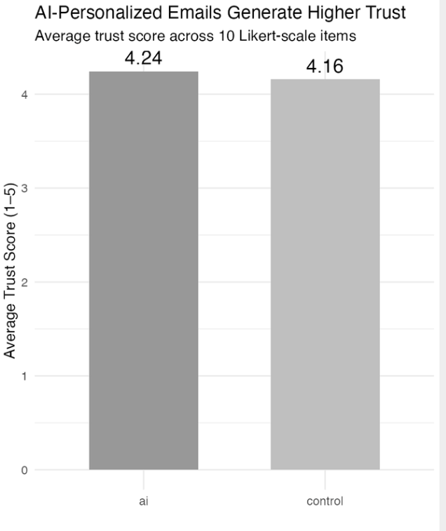
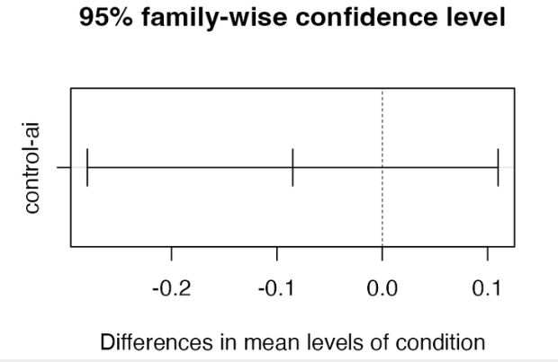

# 📊 Marketing Analytics Projects

This page showcases my hands-on experience using data analytics, visualization, and strategic insight to solve real-world marketing problems.

------------------------------------------------------------------------

## MEin3D — AI-Powered Email Personalization (Graduate Capstone)

**From Clicks to Conversions: AI Powered Email Personalization Strategies for MEin3D**

# AI-Personalized Email Marketing & Consumer Trust

**Culminating Experience Project (CEP)** — Graduate research investigating whether AI-personalized emails generate higher consumer trust compared to standard emails, using an experimental survey design.

-   🎯 **Focus:** AI email personalization, consumer trust, and email marketing effectiveness
-   📊 **Tools Used:** R, Qualtrics, Excel
-   🔬 **Methodology:** Experimental design (A/B test), One-Way ANOVA, Tukey HSD post-hoc test, Likert-scale survey (10 trust items)
-   📈 **Outcome:** AI-personalized emails scored slightly higher in trust (M = 4.24) versus control (M = 4.16), but the difference was not statistically significant (F = 0.745, p = 0.39), suggesting trust levels are comparably high across both conditions.

------------------------------------------------------------------------

### 📊 Key Findings

**Average Trust Score by Condition**

**95% Tukey Confidence Interval**

**Summary Statistics Table**

| Statistic            | Value                                            |
|----------------------|--------------------------------------------------|
| Mean Trust (AI)      | 4.24                                             |
| Mean Trust (Control) | 4.16                                             |
| Mean Difference      | 0.08                                             |
| F-Statistic          | 0.745                                            |
| p-Value              | 0.39                                             |
| 95% CI (Tukey)       | \[-0.280, 0.110\]                                |
| Tukey p-Value        | 0.39                                             |
| Interpretation       | No statistically significant difference in trust |

**Trust Item Breakdown by Condition**

------------------------------------------------------------------------

### 💡 Insights

-   Both AI and control emails generated **high trust scores** (above 4.0 on a 5-point scale), suggesting the email content itself was well-received regardless of personalization.

-   The AI condition scored higher on **data comfort** and **accuracy/reliability**, while the control scored slightly higher on **privacy respect** and **authenticity**.

-   The lack of statistical significance may reflect a **ceiling effect** — participants rated both emails highly, leaving little room to detect meaningful differences.
## Future research could explore trust differences with **larger, more diverse samples** or test emails with stronger AI personalization cues.

------------------------------------------------------------------------