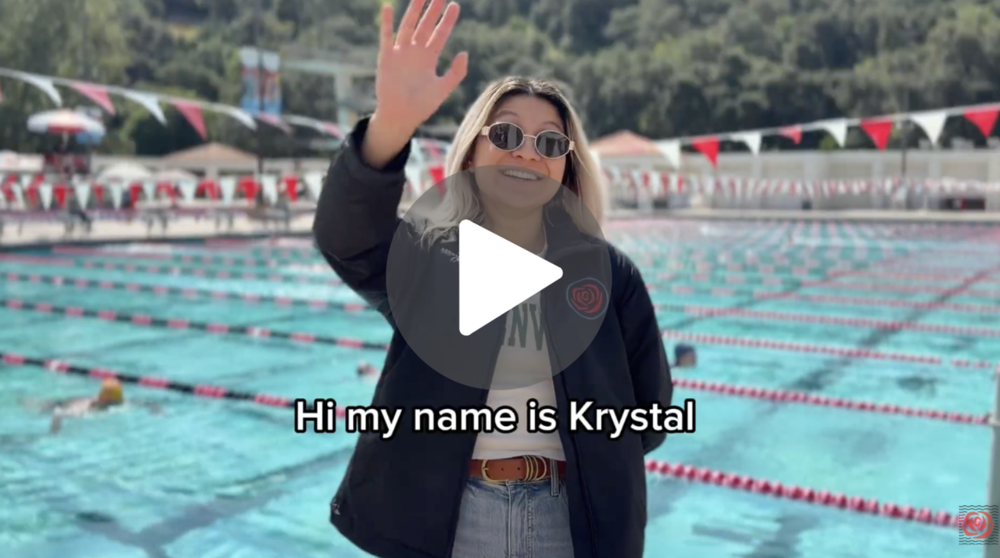
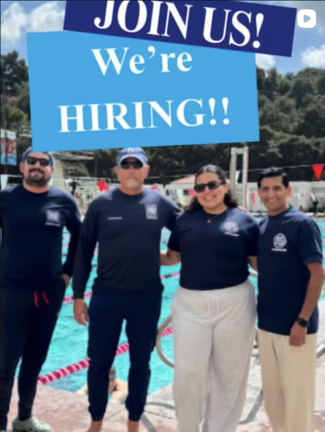
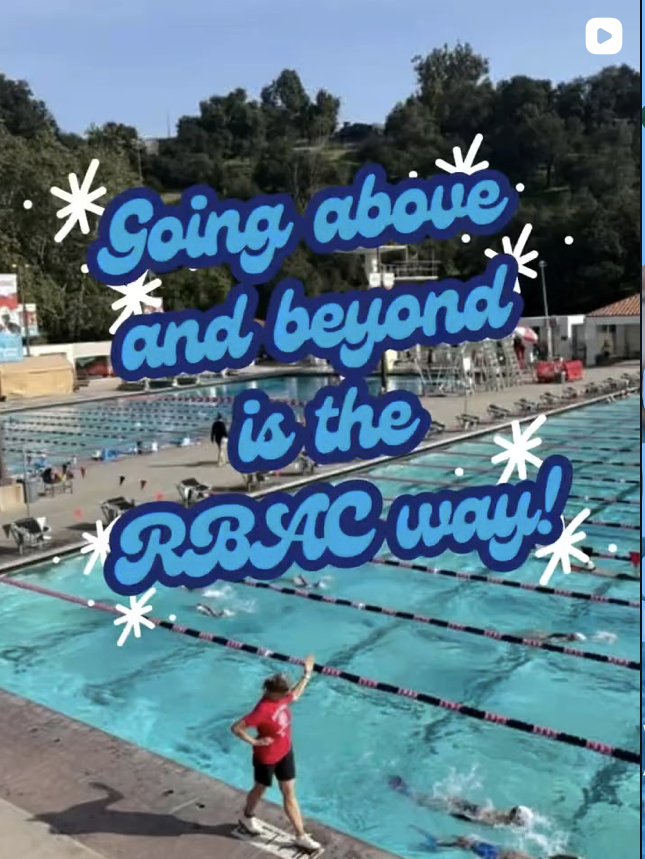
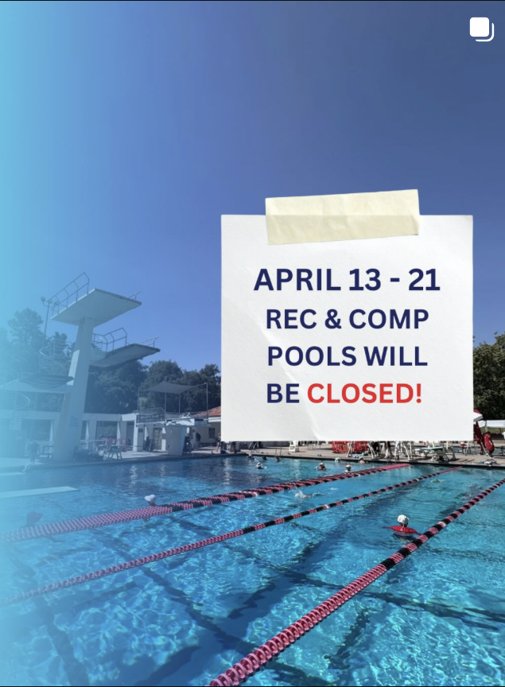
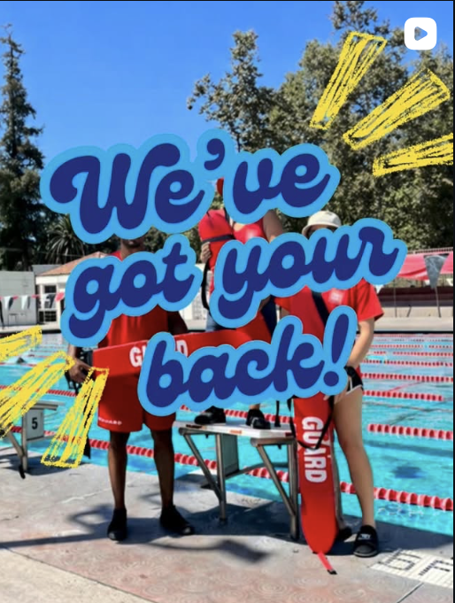
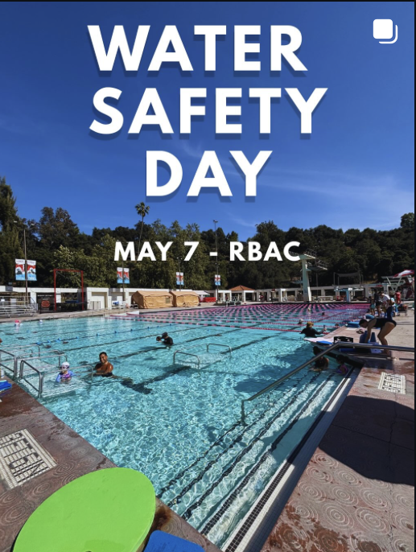
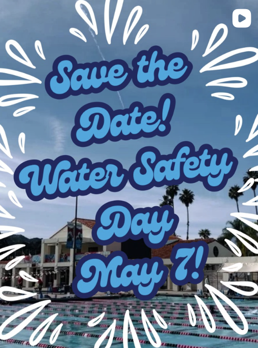
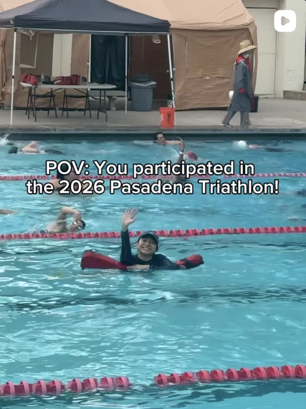
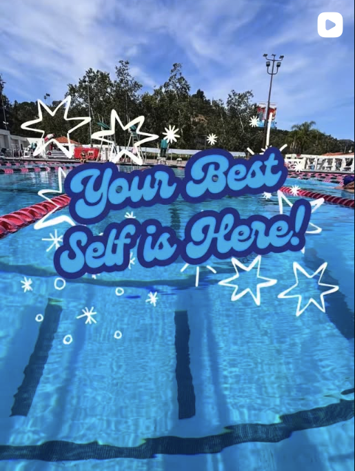
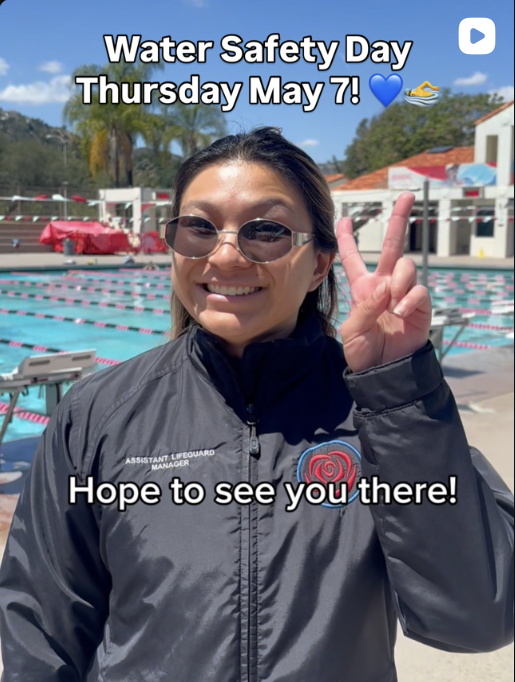

# 🌸 Digital Marketing Projects

This page showcases selected projects from my professional and academic experience in campaign strategy, content creation, and lifecycle marketing.

------------------------------------------------------------------------

## 1. 🏊 Digital Marketing Assistant — Rose Bowl Aquatics Center

**📅 March 2026 – Present \| Pasadena, CA**

As Digital Marketing Assistant, I create and manage content across social media, email campaigns, and video — supporting the RBAC's mission of water safety, community engagement, and program awareness.

### 📧 Employee Email Newsletters

I designed and distributed monthly employee newsletters using **Feathr**, covering staff spotlights, upcoming events, new hires, and internal announcements.

::: card
<h3>📬 March 2026 Employee Newsletter</h3>

Highlighted Gratitude Grams, welcomed new team members, announced CPR/AED certification opportunities, and introduced my own role as Digital Marketing Assistant.

<a class="btn" href="https://polo.feathr.co/v1/view_email?cpn_id=69c1bde98af2d7cb598dbdbb&t_id=69c1bde98af2d7cb598dbdbc" target="_blank">✨ View March Newsletter</a>
:::

::: card
<h3>📬 April 2026 Employee Newsletter</h3>

Promoted the Dodgers Night employee event with RSVP link, introduced new team members, highlighted the Pasadena Triathlon and UCLA Spring Game, and teased the upcoming Mother's Day Scavenger Hunt.

<a class="btn" href="https://polo.feathr.co/v1/view_email?cpn_id=69dd03005bb251ce5953a24f&t_id=69dd03005bb251ce5953a250" target="_blank">✨ View April Newsletter</a>
:::

### 🎥 Video Content — Water Safety Month

:::::: card
<h3>🌊 "Water Safety Begins Before You Get On the Pool Deck"</h3>

Featured in an RBAC community-wide email blast, this video stars me as <strong>Assistant Lifeguard Manager</strong>, walking the RBAC community through the daily pool preparation checklist — showing how water safety is built into everything before a swimmer ever steps on deck.

Sent to the full RBAC community as part of <strong>Water Safety Month (May 2026)</strong>, promoting the <em>Treading for Water Safety Challenge</em> fundraiser.

<a href="https://www.youtube.com/watch?v=Vg0kY3PfxBY" target="_blank" style="display:block;position:relative;border-radius:12px;overflow:hidden;max-width:600px;margin:16px auto;"> 

:::: {style="position:absolute;top:50%;left:50%;transform:translate(-50%,-50%);background:rgba(0,0,0,0.6);border-radius:50%;width:72px;height:72px;display:flex;align-items:center;justify-content:center;"}
::: {style="width:0;height:0;border-top:18px solid transparent;border-bottom:18px solid transparent;border-left:30px solid white;margin-left:6px;"}
:::
::::

</a>

::: {style="text-align:center;margin-top:12px;"}
<a class="btn" href="https://polo.feathr.co/v1/view_email?cpn_id=69c18d5f941832ded8bbf0ed&t_id=69c19544d23ca1842fc75e14" target="_blank">📧 View the Community Email Blast</a>
:::
::::::

### 📱 Instagram Content

I create regular posts for [\@theRBAC](https://www.instagram.com/therbac/) covering program promotions, water safety awareness, community events, and staff highlights.

::: {style="display: grid; grid-template-columns: repeat(3, 1fr); gap: 12px; margin-top: 16px;"}

:::

------------------------------------------------------------------------

### 2. 🎵 Spotify Business Analysis — Whittier College

**🗓 April 2023 \| Co-presented with Isabella Garcia**

In 2023, before Spotify launched its AI DJ feature, my group partner and I recommended that Spotify implement AI-driven personalization tools to deepen engagement and differentiate from competitors. Shortly after, Spotify began rolling out exactly that.

-   🎯 **Focus:** AI integration strategy, music personalization, competitive positioning
-   📈 **Outcome:** Proposed AI-driven recommendations — features Spotify later launched

::: {.card style="text-align:center; padding: 24px;"}

Browse all 24 slides — click to expand fullscreen, use arrow keys to navigate.

<a class="btn" href="spotify-slideshow.html" target="_blank">🎞️ Open Interactive Presentation</a>
:::