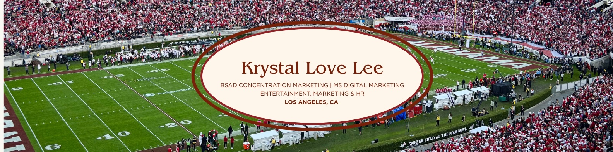

# 🌸 Hi, I'm Krystal

  

Welcome to my digital marketing & analytics portfolio — a curated collection of projects showcasing my work in:

-   Digital marketing strategy\
-   Marketing analytics\
-   Brand ambassador & event marketing

  <h2>✨ Explore My Work</h2>
  <ul>
    <li><a href="digital-marketing.qmd">Digital Marketing Projects</a></li>
    <li><a href="analytics.qmd">Marketing Analytics Projects</a></li>
    <li><a href="resume.qmd">Resume</a></li>
  </ul>

I'm a Digital Marketing Master's student at Cal Poly Pomona with hands-on experience in: 

- Event operations (Rose Bowl Stadium) 
- Aquatics marketing & HR (RBAC) 
- Brand ambassador campaigns (Farmer John Tour and Disney x Brooks) 
- Data-driven marketing analytics

I love blending creativity with analytics to tell compelling stories.

## Let’s Connect

[<i class="bi bi-linkedin"></i> Connect on LinkedIn](https://www.linkedin.com/in/krystal-lee-37992b233)  
[<i class="bi bi-envelope-fill"></i> Email Me](mailto:krystallovelee15@gmail.com)
